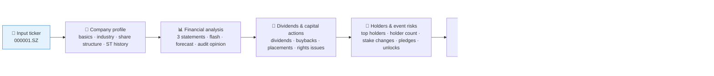
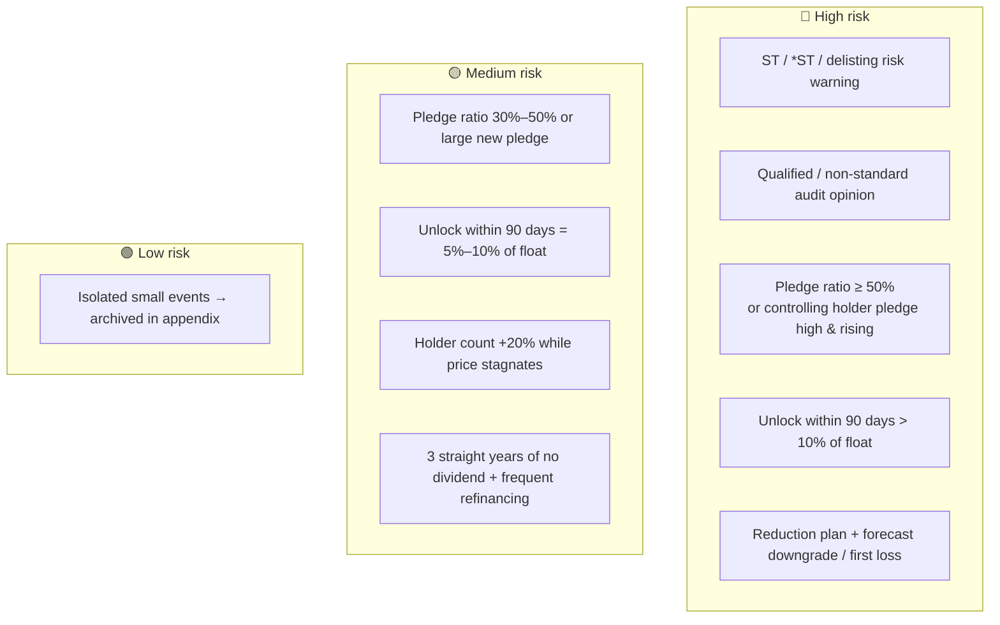

# 🩺 A-Share Stock Dossier Skill

[简体中文](README.md) | **English**

> Give it one A-share ticker, get back a fully sourced Chinese due-diligence dossier: fundamentals, dividends & capital actions, shareholder behavior, pledge/unlock/reduction risks, and market funds — all in one pass.

<p align="center">
  
  
  
  
  
  
</p>

---

## 📖 What is this

`a-share-stock-dossier` is an **Agent Skill**: one-shot due diligence for a single A-share stock (e.g. `000001.SZ`). It chains 25+ scattered Pandadata interfaces into a pipeline of **5 data stages**, applies **10 graded risk rules**, and produces a 9-section structured report — every conclusion is annotated with its source interface, reporting period / data date, and query window.

Its most valuable capability is **combining risk signals**: a high pledge ratio or an upcoming unlock date alone is rarely fatal, but stacked signals like "high pledge ratio **+** unlock approaching" or "reduction plan **+** earnings forecast downgrade" are the real minefields. This skill ships with these combination rules built in and auto-triggered.

> All data contracts come from the sibling skill [`pandadata-api`](https://github.com/quantskills/skill-pandadata-api); this skill decides *what to query and how to judge*, not *what the interfaces look like*.

---

## ⚡ Due-Diligence Pipeline



---

## 🗂️ Five Data Stages × Interface Map

| Stage | Interfaces | Question answered |
|---|---|---|
| 🏢 **Company profile** | `get_stock_detail` · `get_stock_industry` · `get_share_float` · `get_stock_status_change` | What kind of company is this? Share structure? Any ST history? |
| 📊 **Financial statements** | `get_fina_reports` · `get_fina_performance` · `get_fina_forecast` · `get_audit_opinion` | Revenue / profit / cash-flow trends? Forecast reversals? Qualified audit opinions? |
| 💸 **Dividends & capital actions** | `get_stock_dividend` · `get_stock_cash_dividend` · `get_stock_dividend_amount` · `get_repurchase` · `get_stock_private_placement` · `get_stock_allotment` · `get_stock_split` · `get_investor_activity` | Rewarding shareholders, or repeatedly draining them? |
| 👥 **Holders & event risks** | `get_top_holders` · `get_holder_count` · `get_stock_shareholder_change` · `get_stock_pledge` · `get_stock_pledge_stat` · `get_restricted_list` | Ownership concentration? Reduction plans? Pledge ratio? Future unlock pressure? |
| 💹 **Market funds** | `get_stock_daily` · `get_lhb_list` · `get_lhb_detail` · `get_block_trade` · `get_margin` · `get_hsgt_hold` | Price/volume anomalies? Broker-seat flows? Northbound in/out? |

---

## 🚨 Risk Rule Engine

Default rules at a glance (thresholds can be overridden by the user; rules degrade to qualitative notes when a denominator is missing):



Combination signals are named explicitly, e.g. `high pledge ratio + unlock approaching`, `reduction plan + forecast downgrade`. Full rule text and trigger definitions live in [`references/dossier-guide.md`](references/dossier-guide.md).

---

## 🚀 Quick Start

### 1️⃣ Install (together with pandadata-api)

```bash
# Claude Code (global)
cp -r skill-pandadata-api         ~/.claude/skills/pandadata-api
cp -r skill-a-share-stock-dossier ~/.claude/skills/a-share-stock-dossier

# Codex (global, Agent Skills standard directory recommended)
mkdir -p ~/.agents/skills
cp -r skill-pandadata-api ~/.agents/skills/pandadata-api
cp -r skill-a-share-stock-dossier ~/.agents/skills/a-share-stock-dossier

# Cursor (project level)
mkdir -p .cursor/skills
cp -r skill-pandadata-api .cursor/skills/pandadata-api
cp -r skill-a-share-stock-dossier .cursor/skills/a-share-stock-dossier
```

### 2️⃣ Ask in natural language

```text
给 000001.SZ 做一份个股体检报告
帮我尽调一下隆基绿能，重点看质押和解禁
603501 最近三年财务质量怎么样？有没有减持和质押风险？
```

### 3️⃣ Report structure (fixed 9 sections)

```
Summary & conclusions → Company overview → Financial analysis → Dividends & capital actions
→ Shareholder structure & changes → Risk events → Market funds → Risk signal list → Data appendix
```

The risk signal list is a table: `risk level | signal | trigger rule | evidence | date | source interface`.
The data appendix is a table: `data module | source interface | query window | rows returned | latest date/period | notes`.

---

## 📦 Directory Layout

```
a-share-stock-dossier/
├── SKILL.md                      # Skill entry: workflow, analysis rules, quality gates
├── references/
│   └── dossier-guide.md          # 📒 Interface stage map, derived metrics, risk rules, report blueprint, QA checklist
└── agents/
    └── openai.yaml               # OpenAI/Codex adapter
```

---

## 📐 Core Constraints

| Constraint | Description |
|---|---|
| 🧾 Contract first | Every call is checked against `pandadata-api` for parameters and fields; no invented interfaces |
| 🧮 Transparent formulas | Derived metrics (growth, gross margin, ROE, cash-flow match) must state formula and field names |
| 📅 Same-period comparison | Financial YoY uses identical reporting periods; single-quarter and cumulative figures never mixed |
| 🕳️ Report empty data honestly | Sections without data keep their heading plus "no data + query method/window"; never silently skipped |
| 🗣️ Restrained wording | Event signals use "may indicate" / "worth monitoring"; no up/down calls, no buy/sell language |

---

## ⚠️ Disclaimer

Reports are generated from public data and rule-based analysis, for research reference only. Nothing here constitutes investment advice.

## 📜 License

This project is licensed under the GNU General Public License v3.0. See [LICENSE](LICENSE).
