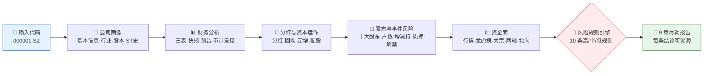
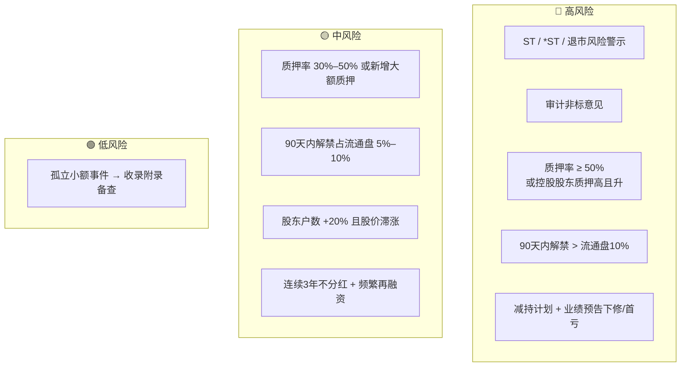

# 🩺 A-Share Stock Dossier Skill

> 输入一个 A 股代码，输出一份可溯源的中文个股尽调报告：基本面、分红资本运作、股东行为、质押解禁减持风险、资金面，一次查清。

<p align="center">
  
  
  
  
  
  
</p>

---

## 📖 这是什么

`a-share-stock-dossier` 是一个 **Agent Skill**：对单只 A 股（如 `000001.SZ`）做一键尽调。它把分散在 Pandadata 的 25+ 个接口按 **5 个数据阶段**串成流水线，叠加 **10 条分级风险规则**，最终产出 9 章结构化报告 —— 每个结论都标注来源接口、报告期/数据日和查询窗口。

它最有价值的能力是**组合风险信号**：单看质押率或解禁日历都不可怕，"质押率高 **+** 解禁临近"、"减持计划 **+** 业绩预告下修"这类叠加才是真正的雷区，本技能内置了这些组合规则的自动触发。

> 数据契约一律来自姊妹技能 [`pandadata-api`](https://github.com/quantskills/skill-pandadata-api)；本技能负责"查什么、怎么判"，不负责"接口长什么样"。

---

## ⚡ 尽调流水线



---

## 🗂️ 五个数据阶段 × 接口映射

| 阶段 | 接口 | 回答什么 |
|---|---|---|
| 🏢 **公司画像** | `get_stock_detail` · `get_stock_industry` · `get_share_float` · `get_stock_status_change` | 这是家什么公司？股本结构？有无 ST 历史？ |
| 📊 **财务报表** | `get_fina_reports` · `get_fina_performance` · `get_fina_forecast` · `get_audit_opinion` | 营收/利润/现金流趋势？预告变脸？审计非标？ |
| 💸 **分红与资本运作** | `get_stock_dividend` · `get_stock_cash_dividend` · `get_stock_dividend_amount` · `get_repurchase` · `get_stock_private_placement` · `get_stock_allotment` · `get_stock_split` · `get_investor_activity` | 回报股东还是频繁抽血？ |
| 👥 **股东与事件风险** | `get_top_holders` · `get_holder_count` · `get_stock_shareholder_change` · `get_stock_pledge` · `get_stock_pledge_stat` · `get_restricted_list` | 筹码集中度？减持计划？质押率？未来解禁压力？ |
| 💹 **资金面** | `get_stock_daily` · `get_lhb_list` · `get_lhb_detail` · `get_block_trade` · `get_margin` · `get_hsgt_hold` | 量价异动？席位资金？北向进出？ |

---

## 🚨 风险规则引擎

默认规则一览（可由用户阈值覆盖，缺分母时自动降级为定性提示）：



组合信号会被显式命名，例如 `质押率高 + 解禁临近`、`减持计划 + 业绩预告下修`。完整规则文本与触发口径见 [`references/dossier-guide.md`](references/dossier-guide.md)。

---

## 🚀 快速开始

### 1️⃣ 安装（与 pandadata-api 一起）

```bash
# Claude Code（全局）
cp -r skill-pandadata-api      ~/.claude/skills/pandadata-api
cp -r skill-a-share-stock-dossier ~/.claude/skills/a-share-stock-dossier

# Codex（全局，推荐开放 Agent Skills 标准目录）
mkdir -p ~/.agents/skills
cp -r skill-pandadata-api ~/.agents/skills/pandadata-api
cp -r skill-a-share-stock-dossier ~/.agents/skills/a-share-stock-dossier

# Cursor（项目级）
mkdir -p .cursor/skills
cp -r skill-pandadata-api .cursor/skills/pandadata-api
cp -r skill-a-share-stock-dossier .cursor/skills/a-share-stock-dossier
```

### 2️⃣ 直接用自然语言提问

```text
给 000001.SZ 做一份个股体检报告
帮我尽调一下隆基绿能，重点看质押和解禁
603501 最近三年财务质量怎么样？有没有减持和质押风险？
```

### 3️⃣ 报告结构（固定 9 章）

```
摘要与结论 → 公司概况 → 财务分析 → 分红与资本运作 → 股东结构与变动
→ 风险事件 → 资金面 → 风险信号清单 → 数据附录
```

风险信号清单为表格：`风险等级 | 信号 | 触发规则 | 证据 | 日期 | 来源接口`。
数据附录为表格：`数据模块 | 来源接口 | 查询窗口 | 返回行数 | 最新日期/报告期 | 备注`。

---

## 📦 目录结构

```
a-share-stock-dossier/
├── SKILL.md                      # 技能入口：工作流、分析规则、质量门槛
├── references/
│   └── dossier-guide.md          # 📒 接口阶段地图、衍生指标、风险规则、报告蓝图、QA清单
└── agents/
    └── openai.yaml               # OpenAI/Codex 适配
```

---

## 📐 核心约束

| 约束 | 说明 |
|---|---|
| 🧾 先查契约 | 所有调用先经 `pandadata-api` 核对参数字段，不发明接口 |
| 🧮 公式透明 | 增速、毛利率、ROE、现金流匹配度等衍生指标必须写出公式与字段名 |
| 📅 同期对比 | 财务同比用相同报告期，单季与累计口径不混用 |
| 🕳️ 空数据如实报 | 无数据的章节保留标题并写明"无数据 + 查询方法/窗口"，不静默跳过 |
| 🗣️ 措辞克制 | 事件信号用"可能提示""需要关注"，不下涨跌结论，不用买卖语言 |

---

## ⚠️ 免责声明

本报告基于公开数据与规则化分析生成，仅供研究参考，不构成任何投资建议。

## 📜 License

This project is licensed under the GNU General Public License v3.0. See [LICENSE](LICENSE).
